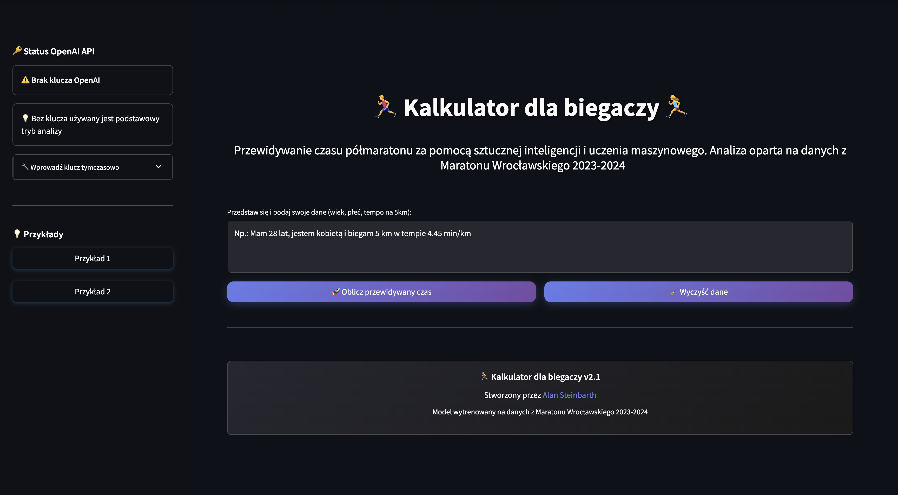
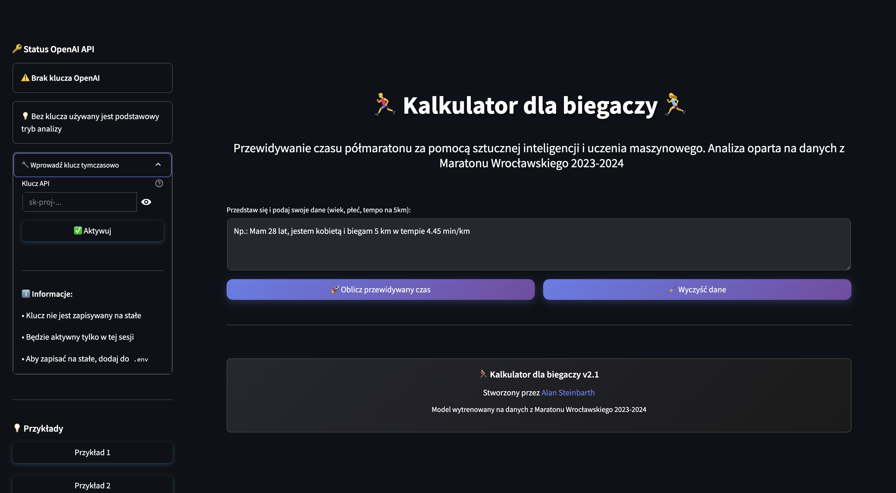
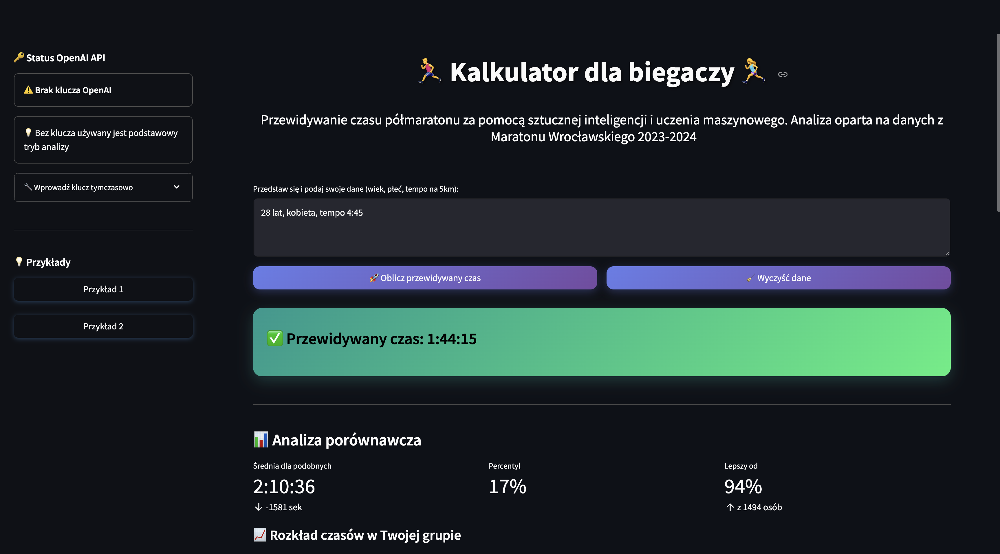
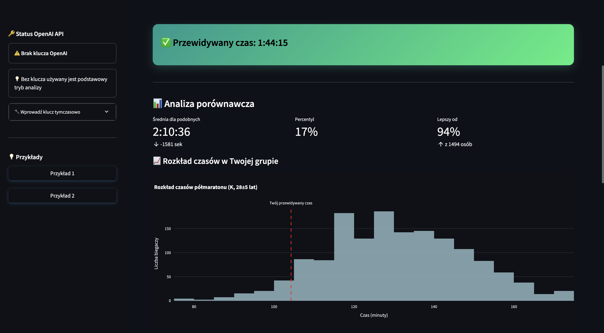

# 🏃‍♂️ Kalkulator dla biegaczy v2.1

<p align="center">
  
</p>

[](https://github.com/AlanSteinbarth/Kalkulator-dla-biegaczy/actions/workflows/tests.yml)
[](https://www.python.org/downloads/)
[](https://streamlit.io)
[](https://openai.com)

> **Profesjonalna aplikacja webowa** do przewidywania czasu ukończenia półmaratonu przy użyciu **uczenia maszynowego** i **sztucznej inteligencji**.

---
## 📑 Spis treści
1. [Cel projektu](#-cel-projektu)
2. [Kluczowe funkcjonalności](#-kluczowe-funkcjonalności)
3. [Demo na żywo](#-demo-na-żywo)
4. [Dane i model](#-dane-i-model)
5. [Instalacja i uruchomienie](#-instalacja-i-uruchomienie)
6. [Obsługa klucza OpenAI](#obsługa-klucza-openai)
7. [Changelog](#-changelog)
8. [Licencja](#licencja)
9. [Zrzuty ekranu](#-zrzuty-ekranu)

---

## 🛠️ Technologie i narzędzia

Projekt wykorzystuje nowoczesny stack technologiczny:

- **Python 3.9+** – główny język programowania
- **Streamlit** – szybkie tworzenie aplikacji webowych
- **PyCaret** – automatyzacja uczenia maszynowego
- **OpenAI (GPT-4)** – ekstrakcja danych z tekstu naturalnego
- **Plotly** – interaktywne wizualizacje
- **Pandas** – analiza i przetwarzanie danych
- **Scikit-learn** – klasyczne algorytmy ML
- **pytest** – testy jednostkowe
- **GitHub Actions** – CI/CD
- **Black, flake8, mypy** – jakość i typowanie kodu

---

## 🎯 Cel projektu

Projekt został stworzony jako **showcase umiejętności** w obszarze:
- **Machine Learning** (PyCaret, Scikit-learn)
- **AI Integration** (OpenAI GPT-4) 
- **Data Visualization** (Plotly)
- **Web Development** (Streamlit)
- **Software Engineering** (testy, CI/CD, clean code)

## ✨ Kluczowe funkcjonalności

### 🤖 Integracja z AI i fallback na regex
- Automatyczne rozpoznawanie danych przez **OpenAI GPT-4** (analiza tekstu naturalnego)
- Fallback na **regex** w przypadku braku klucza lub problemów z API
- Obsługa różnych formatów wejściowych (np. "Mam 35 lat, jestem kobietą, tempo 5km: 5.10 min/km")

### 🛡️ Obsługa błędów i user experience
- Rozbudowane komunikaty dla użytkownika (błędy, ostrzeżenia, podpowiedzi)
- Przykłady do szybkiego wklejenia
- Możliwość wprowadzenia klucza OpenAI tymczasowo lub na stałe
- Tryb podstawowy (regex) działa nawet bez AI

### 🎨 Własne style CSS i dbałość o UI
- Nowoczesny, ciemny motyw i customowe style CSS
- Responsywny, atrakcyjny interfejs (przyciski, metryki, animacje)
- Dbałość o czytelność i dostępność

### 📊 Analiza porównawcza z danymi historycznymi
- Porównanie wyniku użytkownika do grupy wiekowej i płci
- Interaktywne wykresy (Plotly) i fallback HTML
- Statystyki: średnia, percentyl, pozycja w grupie
- Analiza zależności tempo vs czas półmaratonu

---

## 🚀 Demo na żywo

**[👉 Wypróbuj aplikację na Streamlit Cloud](https://kalkulator-dla-biegaczy.streamlit.app/)**

## 📊 Dane i model

### Zbiór danych
- **Źródło**: Maraton Wrocławski 2023-2024
- **Rozmiar**: 1,247 rekordów
- **Cechy**: wiek, płeć, tempo 5km, czas półmaratonu

### Model ML
- **Algorytm**: Huber Regression (odporny na outliers)
- **R² Score**: 0.85
- **MAE**: 12.3 minuty
- **Framework**: PyCaret

## 🚦 Szybka instrukcja uruchomienia (dla początkujących)

**Jak uruchomić aplikację krok po kroku:**

1. **Zainstaluj Pythona**  
   Pobierz i zainstaluj [Python 3.9 lub nowszy](https://www.python.org/downloads/).

2. **Pobierz projekt**  
   Kliknij „Code” → „Download ZIP” lub użyj komendy:
   ```bash
   git clone https://github.com/AlanSteinbarth/Kalkulator-dla-biegaczy.git
   ```
   Następnie rozpakuj plik ZIP lub przejdź do folderu projektu:
   ```bash
   cd Kalkulator-dla-biegaczy
   ```

3. **Zainstaluj wymagane biblioteki**  
   W terminalu wpisz:
   ```bash
   pip install -r requirements.txt
   ```

4. **Dodaj klucz OpenAI (opcjonalnie, ale zalecane)**  
   - Otwórz Notatnik i wpisz:
     ```
     OPENAI_API_KEY=sk-...tutaj_twój_klucz...
     ```
   - Zapisz plik jako `.env` w głównym folderze projektu.

   Jeśli nie masz klucza, aplikacja zadziała w trybie podstawowym (bez AI).

5. **Uruchom aplikację**  
   W terminalu wpisz:
   ```bash
   streamlit run app.py
   ```
   Otworzy się przeglądarka z aplikacją.

---

## 📁 Struktura projektu

```
kalkulator-dla-biegaczy/
├── 📱 app.py                    # Główna aplikacja Streamlit
├── ⚙️ config.py                 # Konfiguracja aplikacji  
├── 📊 df_cleaned.csv            # Dane treningowe
├── 🤖 huber_model_*.pkl         # Wytrenowany model ML
├── 📋 requirements.txt          # Zależności Python
├── 🔧 pyproject.toml           # Konfiguracja projektu
├── 📚 README.md                # Dokumentacja
├── 📄 CHANGELOG.md             # Historia zmian
├── src/utils/                   # Moduły pomocnicze
│   ├── validation.py           # Walidacja danych
│   ├── model_utils.py          # Funkcje ML
│   ├── data_processing.py      # Przetwarzanie danych
│   └── visualization.py        # Wizualizacje
├── tests/                      # Testy jednostkowe
│   └── test_validation.py
├── .github/workflows/          # CI/CD GitHub Actions
│   └── tests.yml
└── dane/                       # Surowe dane
    ├── halfmarathon_2023.csv
    └── halfmarathon_2024.csv
```

## 🧪 Testy i jakość kodu

### Uruchamianie testów
```bash
# Wszystkie testy
pytest

# Z pokryciem kodu
pytest --cov=src

# Tylko konkretny plik
pytest tests/test_validation.py -v
```

### Sprawdzenie jakości
```bash
# Formatowanie kodu
black . --check

# Linting
flake8 .

# Type checking
mypy src/
```

## 🚀 Deployment na Streamlit Cloud

### Automatyczny deployment
1. **Fork** tego repozytorium
2. Połącz z **[Streamlit Cloud](https://share.streamlit.io)**
3. Dodaj **secrets** w ustawieniach:
   ```toml
   OPENAI_API_KEY = "your_api_key_here"
   ```
4. Deploy automatycznie się uruchomi! 🎉

### Konfiguracja production
```toml
# .streamlit/config.toml
[server]
headless = true
port = $PORT

[theme]
primaryColor = "#FF4B4B"
backgroundColor = "#FFFFFF"
secondaryBackgroundColor = "#F0F2F6"
```

## 📈 Roadmap i przyszłe funkcjonalności

- [ ] **Więcej dystansów**: 10km, maraton
- [ ] **Analiza pogody**: wpływ warunków atmosferycznych  
- [ ] **Historia treningów**: tracking postępów
- [ ] **API REST**: integracja z innymi aplikacjami
- [ ] **Mobile app**: wersja mobilna
- [ ] **Social features**: porównywanie z przyjaciółmi

## 🤝 Wkład w projekt (Contributing)

Zachęcam do współpracy! 

### Jak zacząć:
1. **Fork** repozytorium
2. Utwórz **feature branch**: `git checkout -b feature/amazing-feature`
3. **Commit** zmiany: `git commit -m 'Add amazing feature'`
4. **Push** do brancha: `git push origin feature/amazing-feature`
5. Otwórz **Pull Request**

### Zasady:
- ✅ Wszystkie testy muszą przechodzić
- ✅ Kod musi być sformatowany (Black)
- ✅ Dodaj testy dla nowych funkcjonalności
- ✅ Aktualizuj dokumentację

## 📊 Metryki projektu


## 👨‍💻 Autor

**Alan Steinbarth**
- 🐙 GitHub: [@AlanSteinbarth](https://github.com/AlanSteinbarth)
- 📧 Email: alan.steinbarth@gmail.com
- 💼 LinkedIn: [Alan Steinbarth](https://linkedin.com/in/alan-steinbarth)

## 📄 Licencja

Ten projekt jest licencjonowany na licencji MIT - szczegóły w pliku [LICENSE](LICENSE).

## 🙋‍♂️ FAQ

**Q: Czy aplikacja działa offline?**  
A: Nie, wymaga połączenia z internetem do OpenAI API.

**Q: Jakie są koszty korzystania?**  
A: Aplikacja jest darmowa, ale wymaga klucza API OpenAI (~$0.01 za zapytanie).

**Q: Czy mogę dodać swoje dane treningowe?**  
A: Tak! Sprawdź sekcję Contributing powyżej.

**Q: Na ile dokładny jest model?**  
A: Model ma R² = 0.85, średni błąd to ~12 minut.

---

<div align="center">

**⭐ Jeśli projekt Ci się podoba, zostaw gwiazdkę! ⭐**

*Stworzony z ❤️ dla społeczności biegaczy*

</div>

## 🔑 Obsługa klucza OpenAI API

### Status klucza w aplikacji
Aplikacja wyświetla szczegółowe informacje o statusie klucza OpenAI w sidebarze:

- ✅ **Klucz prawidłowy** - AI jest aktywne, zaawansowana analiza tekstu włączona
- ❌ **Klucz nieprawidłowy** - Problemy z weryfikacją klucza
- ⚠️ **Brak klucza** - Używany jest prostszy tryb analizy (regex)

### Konfiguracja klucza

#### Opcja 1: Plik .env (zalecana)
```bash
# Utwórz plik .env w głównym katalogu
echo "OPENAI_API_KEY=sk-proj-twoj_klucz_tutaj" > .env
```

#### Opcja 2: Tymczasowo w aplikacji
1. Uruchom aplikację bez klucza w .env
2. W sidebarze kliknij **"🔧 Wprowadź klucz tymczasowo"**
3. Wpisz klucz i kliknij **"✅ Aktywuj"**
4. Klucz będzie aktywny tylko w bieżącej sesji

### Komunikaty dla użytkownika
- **🔍 Sprawdź** - weryfikuje poprawność klucza bez aktywacji
- **🧪 Testuj klucz z .env** - testuje klucz z pliku konfiguracyjnego
- **🔄 Ponownie sprawdź klucz** - weryfikuje aktywny klucz
- **🔴 Wyłącz AI** - dezaktywuje tryb AI

### Rozwiązywanie problemów
- **Nieprawidłowy format**: Klucz musi zaczynać się od 'sk-'
- **Klucz wygasł**: Sprawdź na [platform.openai.com/api-keys](https://platform.openai.com/api-keys)
- **Problemy z rozliczeniami**: Sprawdź [platform.openai.com/usage](https://platform.openai.com/usage)
- **Bez klucza**: Aplikacja działa w trybie podstawowym (analiza regex)

## 🖼️ Zrzuty ekranu

Poniżej prezentowane są wybrane ekrany aplikacji wraz z krótkimi opisami:

### Ekran główny aplikacji



Widok startowy aplikacji: panel boczny z obsługą klucza OpenAI, przykłady, pole do wprowadzania danych użytkownika oraz przyciski do obliczania i czyszczenia. Na dole stopka z informacją o autorze i wersji.

---

### Wynik predykcji i analiza porównawcza



Po wprowadzeniu danych i kliknięciu "Oblicz przewidywany czas" pojawia się przewidywany czas półmaratonu, analiza porównawcza (średnia, percentyl, lepszy od ilu osób) oraz histogram rozkładu czasów w grupie porównawczej.

---

### Szczegółowa analiza: wykres zależności tempo vs czas półmaratonu



Wizualizacja zależności między tempem na 5km a czasem półmaratonu (scatter plot). Czerwony punkt oznacza wynik użytkownika. Poniżej dodatkowe statystyki: dane użytkownika oraz statystyki grupy porównawczej.

---

### Przykładowe inne widoki



Przykład ekranu z pustym polem wejściowym i komunikatami o braku klucza OpenAI oraz trybie podstawowym.

---

> Wszystkie zrzuty ekranu znajdują się w folderze [`screenshots/`](./screenshots/). Możesz dodać własne, aby pokazać inne funkcje lub przypadki użycia.
